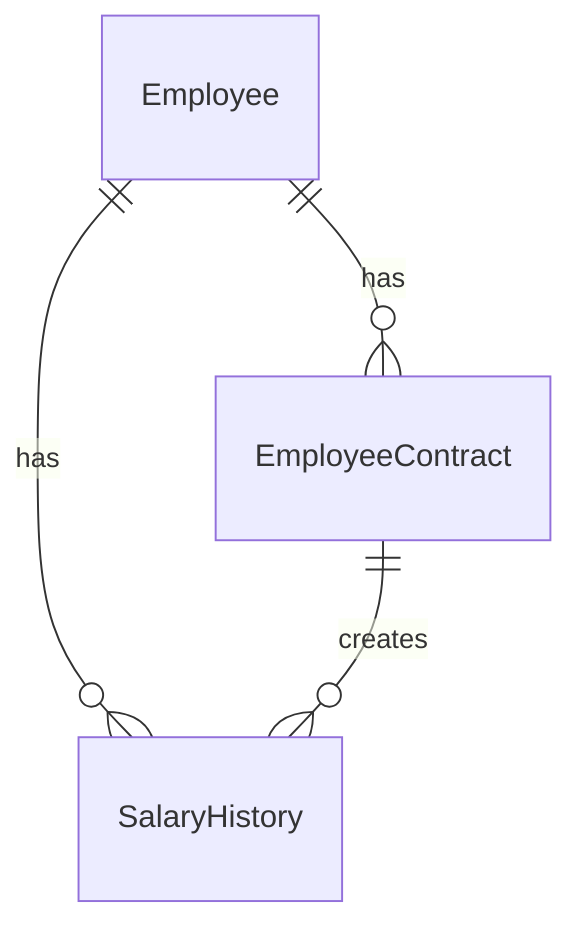

# Data Model

## Entity Overview

## Employee

| Field | Type | Required | Note |
|---|---|---|---|
| Id | Guid | Yes | Primary key |
| FullName | string | Yes | Họ tên nhân viên |
| EmployeeCode | string | Yes | Mã nhân viên |
| DepartmentId | Guid? | No | Phòng ban |
| PositionId | Guid? | No | Chức vụ |

## EmployeeContract

| Field | Type | Required | Note |
|---|---|---|---|
| Id | Guid | Yes | Primary key |
| EmployeeId | Guid | Yes | FK tới Employee |
| ContractCode | string | Yes | Unique |
| ContractType | enum | Yes | Probation, OneYear, ThreeYear, Indefinite |
| StartDate | DateOnly | Yes | Ngày bắt đầu |
| EndDate | DateOnly? | No | Null nếu không xác định thời hạn |
| BaseSalary | decimal | Yes | Lương cơ bản |
| Status | enum | Yes | Draft, Active, Expired, Terminated |

## SalaryHistory

| Field | Type | Required | Note |
|---|---|---|---|
| Id | Guid | Yes | Primary key |
| EmployeeId | Guid | Yes | FK tới Employee |
| ContractId | Guid? | Yes nếu phát sinh từ hợp đồng | FK tới EmployeeContract |
| BaseSalary | decimal | Yes | Lương cơ bản |
| EffectiveDate | DateOnly | Yes | Ngày hiệu lực |
| SourceType | enum | Yes | Contract, Appendix, ManualAdjustment |
| Note | string? | No | Ghi chú |
