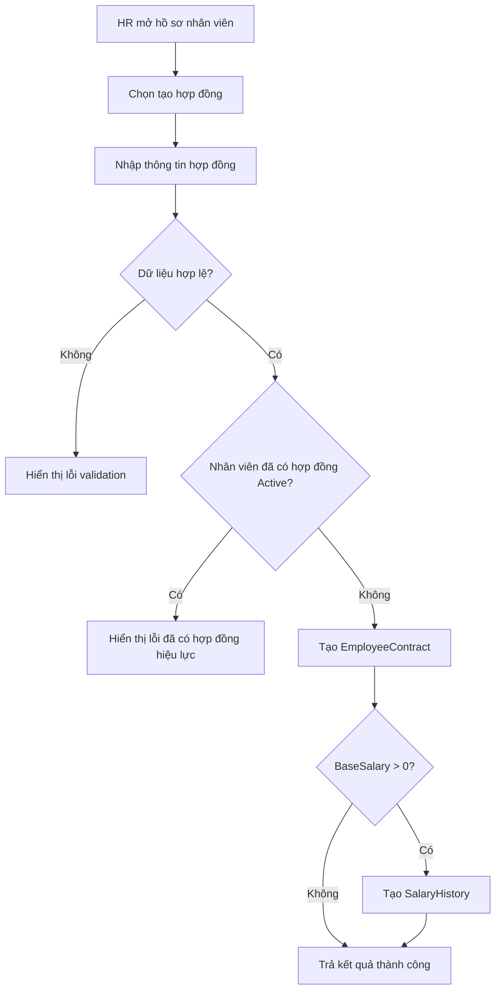
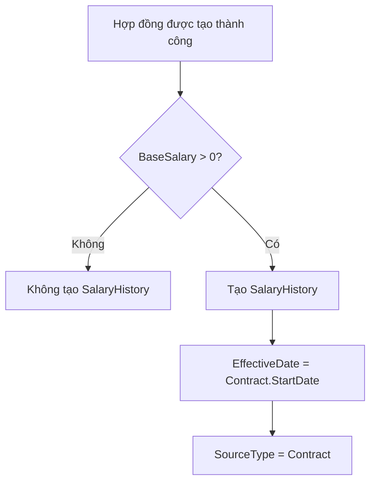

# Workflows

## WF-CONTRACT-001 - Tạo hợp đồng lao động

```mermaid
flowchart TD
    A[HR mở hồ sơ nhân viên] --> B[Chọn tạo hợp đồng]
    B --> C[Nhập thông tin hợp đồng]
    C --> D{Dữ liệu hợp lệ?}
    D -- Không --> E[Hiển thị lỗi validation]
    D -- Có --> F{Nhân viên đã có hợp đồng Active?}
    F -- Có --> G[Hiển thị lỗi đã có hợp đồng hiệu lực]
    F -- Không --> H[Tạo EmployeeContract]
    H --> I{BaseSalary > 0?}
    I -- Có --> J[Tạo SalaryHistory]
    I -- Không --> K[Kết thúc]
    J --> K[Trả kết quả thành công]
```

## WF-SALARY-001 - Tự tạo lịch sử lương từ hợp đồng

```mermaid
flowchart TD
    A[Hợp đồng được tạo thành công] --> B{BaseSalary > 0?}
    B -- Không --> C[Không tạo SalaryHistory]
    B -- Có --> D[Tạo SalaryHistory]
    D --> E[EffectiveDate = Contract.StartDate]
    E --> F[SourceType = Contract]
```
