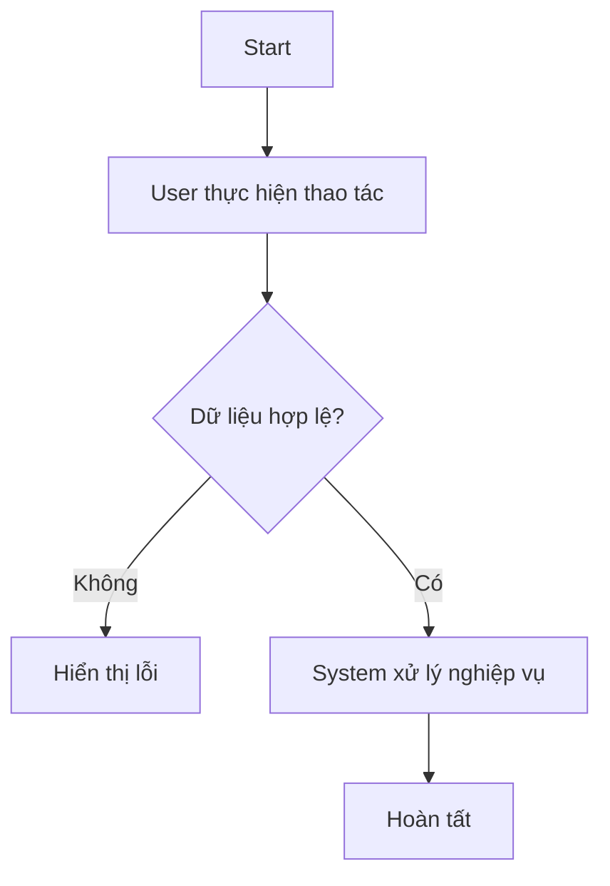
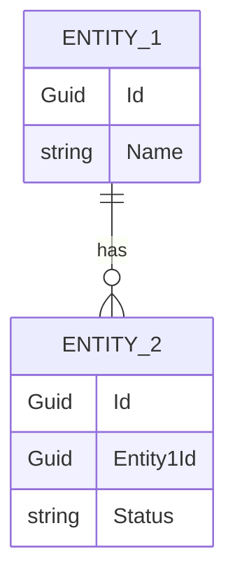

# [FEATURE-ID] - [Tên feature]

## 1. Metadata

| Field | Value |
|---|---|
| Status | Draft / In Review / Approved / Ready for Dev / Done / Changed / Deprecated |
| Priority | Critical / High / Medium / Low |
| Type | Feature |
| Module |  |
| Feature |  |
| Owner |  |
| Source | Stakeholder meeting / Internal analysis / Legal / Operation / Customer Feedback |
| Created Date | YYYY-MM-DD |
| Last Updated | YYYY-MM-DD |
| Version | v1.0 |

## 2. Change Request Summary

| CR ID | Date | Request | Impact | Status | Note |
|---|---|---|---|---|---|
| CR-001 | YYYY-MM-DD |  | Low / Medium / High | Draft / Approved / Rejected / Done |  |

## 3. Change History

| Version | Date | Change | Reason | By |
|---|---|---|---|---|
| v1.0 | YYYY-MM-DD | Tạo requirement ban đầu | New requirement | BA |

## 4. Problem

Mô tả vấn đề thực tế hiện tại mà feature cần giải quyết.

Ví dụ:
Người dùng đang xử lý nghiệp vụ bằng file rời, thao tác thủ công, khó kiểm soát trạng thái, dữ liệu không đồng bộ và khó truy xuất lịch sử.

## 5. Goal

Mô tả mục tiêu nghiệp vụ của feature.

Ví dụ:
Cho phép người dùng quản lý toàn bộ vòng đời của một nghiệp vụ trên hệ thống, giảm thao tác thủ công, chuẩn hóa dữ liệu và làm nền cho các nghiệp vụ liên quan.

## 6. Users / Actors

- Actor 1
- Actor 2
- System

## 7. Scope

### In Scope

- ...
- ...

### Out of Scope

- ...
- ...

## 8. Functions Covered

| Function ID | Function Name | Status | Phase | Note |
|---|---|---|---|---|
| FUNC-001 |  | Draft / Ready for Dev / Done | Phase 1 |  |
| FUNC-002 |  | Draft / Ready for Dev / Done | Phase 1 |  |

## 9. Main Workflow

### 9.1 Workflow Steps

1. ...
2. ...
3. ...

### 9.2 Workflow Diagram

## 10. Business Rules

| Rule ID | Rule | Required | Note |
|---|---|---|---|
| BR-XXX-001 |  | Yes / No |  |

## 11. Data Requirements

### 11.1 Entity Impact

- Entity 1
- Entity 2

### 11.2 ERD Diagram

### 11.3 Fields

| Entity | Field | Type | Required | Note |
|---|---|---|---|---|
|  |  |  | Yes / No |  |

## 12. API/System Impact

| Method | Endpoint / Action | Purpose | Related Function |
|---|---|---|---|
| GET / POST / PUT / DELETE |  |  |  |

## 13. Acceptance Criteria

### AC-001: [Tên acceptance criteria]

Given ...  
When ...  
Then ...

## 14. Edge Cases

- ...
- ...

## 15. Stakeholder Confirmation

| Field | Value |
|---|---|
| Confirmed By |  |
| Confirmed Date |  |
| Confirmation Source | Meeting note / Email / Zalo / Document |
| Note |  |

## 16. Open Questions

| ID | Question | Owner | Status | Note |
|---|---|---|---|---|
| Q-001 |  |  | Open / Deferred / Closed |  |

## 17. Related Specs / Links

| Type | Name | Link / Path | Note |
|---|---|---|---|
| Software Design Spec |  |  |  |
| API Spec |  |  |  |
| Test Cases |  |  |  |
| Stakeholder Confirmation |  |  |  |
